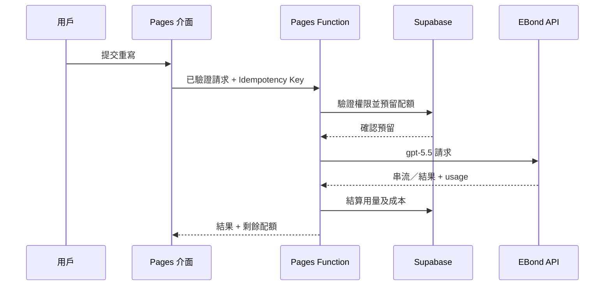

# 後台及會員系統 PRD

> 版本：1.1
> 日期：2026-08-16
> 狀態：Phase 0 產品決策部分已落實
> 語言：香港繁體中文
> 產品：Claude Watermark Guide / AI 文字重寫工具
> 追蹤：[GitHub Issue #1](https://github.com/widecyruschan/claude-watermark-guide/issues/1)

## 問題陳述

現有產品是部署於 Cloudflare Pages 的純靜態工具網站，可以在瀏覽器本機檢查部分不可見 Unicode 字符，但尚未提供用戶系統、伺服器端 AI 重寫、用量控制、訂閱收費或營運後台。用戶無法保存會員狀態、查看剩餘配額、購買方案或管理帳單；營運方亦無法控制成本、處理異常帳戶、查看訂閱狀態，或衡量 AI 請求的質素與毛利。

產品需要保留「本機清理字符，不上傳文字」的優勢，同時加入由 EBond API `gpt-5.5` 驅動的 AI 文字重寫功能，並建立完整但不過度複雜的會員、訂閱、配額及管理後台。系統亦必須避免把「清理不可見字符」錯誤宣傳成可以識別 AI 來源、移除可靠水印，或保證繞過 AI 偵測。

目前已確認的基本條件：

- 前端主體已完成，目前使用原生 HTML、CSS 及 JavaScript。
- 網站部署於 Cloudflare Pages，production 環境已配置加密的 `EBOND_API_KEY`。
- EBond 網關根地址為 `https://api.ebondai.com`，模型為 `gpt-5.5`。
- EBond 價格按每百萬 input/output Token `US$0.6/US$3.6` 估算。
- 優先使用 Responses API，Chat Completions 只作相容回退。
- 預設不保存用戶提交的原文或模型生成的完整結果。
- 正式網域為 `watermarklens.com`，私隱及支援聯絡電郵為 `contact@watermarklens.com`。
- 首發市場為美國，產品及服務介面使用英文。

## 解決方案

在現有 Cloudflare Pages 專案加入同源 Pages Functions API，使用 Supabase 提供身份驗證、Postgres 資料庫及列級權限，並使用 Stripe Checkout、Customer Portal 及 Webhook 提供月度訂閱。

產品向用戶提供兩項清晰而獨立的功能：

1. 本機字符工具：偵測及清理可疑不可見字符、顯示移除統計，並按用戶選擇處理長破折號。整個流程不上傳文字、不要求登入，亦不消耗配額。
2. AI 文字重寫：在保留事實、意思、引用、連結及格式的前提下，改善樣板化表達、重複、僵硬過渡及句式節奏。此流程要求登入，由伺服器呼叫模型並消耗會員字符配額。

系統向免費會員提供可試用但受控的月度配額，向 Pro 會員提供較高配額、較長的單次文字上限及帳單管理。管理後台提供用戶、訂閱、用量、成本、錯誤及審計功能，但不允許管理員查看用戶原文。

## 目標及成功指標

### 產品目標

- 讓新用戶無須學習，即可完成註冊、重寫、查看配額及升級訂閱。
- Stripe 付款成功後，可靠地把付款狀態同步成產品權限。
- 本機字符工具維持永久免費，而且不上傳文字。
- 把 AI 成本限制在可預測範圍，並可按用戶及請求追蹤。
- 為營運人員提供足夠的後台功能，首個版本不建立複雜 CRM 或財務系統。

### 首個版本成功指標

| 指標 | 目標 |
| --- | --- |
| AI 請求成功率 | 最近 24 小時不少於 98% |
| AI 首個字節延遲 | P95 不多於 5 秒 |
| AI 完整請求延遲 | 3,000 字符請求的 P95 不多於 20 秒 |
| 付款權限同步 | 95% 在 30 秒內完成，100% 在 2 分鐘內完成 |
| 重複扣除配額 | 0 |
| 未獲授權的後台存取 | 0 |
| 密鑰進入瀏覽器或 Git | 0 |
| 付費方案模型毛利 | 正常使用情況不少於 70% |

## 產品決策及假設

- 首個版本面向美國市場，以英文提供產品及服務，付費方案使用 USD 月付。
- Pro 暫定為 `US$9/月`，正式建立 Stripe Price 前由產品負責人最終確認。
- Free 每月 10,000 個輸入字符仍屬暫定；單次最多 3,000 字符已確認。
- Pro 每個帳單週期 500,000 個輸入字符仍屬暫定；單次最多 20,000 字符已確認。
- 重寫控制包括語氣下拉選單、正式程度（低／中／高）及重寫強度（低／中／高）。語氣的正式 allowlist 仍須在 Phase 4 開發前確認。
- 系統自動識別並保留用戶的輸入語言，首個版本不提供手動語言選單。
- 用戶介面以輸入字符作為容易理解的配額單位，後台同時記錄實際 input/output Token 及估算成本。
- 首個版本不提供年付、團隊帳戶、按量增值套裝或中國內地本地付款。

## 用戶故事

1. 作為訪客，我希望無須登入便可在本機清理不可見字符，確保文字不會離開瀏覽器。
2. 作為訪客，我希望看到偵測到哪些 Unicode 字符，了解工具作出了甚麼修改。
3. 作為訪客，我希望選擇如何處理長破折號，使輸出符合我的寫作風格。
4. 作為訪客，我希望網站說明字符清理不能證明內容由 AI 撰寫，避免受到誤導。
5. 作為訪客，我希望了解 AI 重寫為何需要帳戶，令免費工具轉到會員功能的流程合理清晰。
6. 作為新用戶，我希望透過電郵 Magic Link 註冊，無須建立另一組密碼。
7. 作為新用戶，我希望使用 Google 登入，以一步完成註冊。
8. 作為用戶，我希望登入工作階段可以安全保留，無須每次使用都重新登入。
9. 作為用戶，我希望可以在目前裝置登出，在共用電腦上保護帳戶。
10. 作為 Free 會員，我希望提交文字作 AI 重寫，在訂閱前評估付費功能。
11. 作為 Free 會員，我希望查看每月剩餘字符，知道請求能否執行。
12. 作為 Free 會員，我希望在配額不足時看到清晰的升級提示，知道如何繼續。
13. 作為會員，我希望選擇語氣、正式程度及重寫強度，同時保留輸入語言，使結果符合我的使用情境。
14. 作為會員，我希望保留事實、名稱、引文、引用、連結及格式，避免重寫破壞內容。
15. 作為會員，我希望逐步接收重寫結果，避免長請求看似停頓。
16. 作為會員，我希望停止正在進行的重寫，以便修正誤提交的內容。
17. 作為會員，我希望供應商暫時故障時獲得清晰的重試指引，避免重複提交付費請求。
18. 作為會員，我希望失敗請求不消耗配額，只為已完成的工作付費。
19. 作為會員，我希望複製或下載結果，在產品以外使用。
20. 作為重視私隱的用戶，我希望系統預設不保存原文及結果，避免保留敏感草稿。
21. 作為用戶，我希望查看目前方案、帳單週期及配額用量，以管理帳戶。
22. 作為用戶，我希望更新顯示名稱，令帳戶資料反映我的身份。
23. 作為用戶，我希望刪除帳戶，掌握自己的個人資料。
24. 作為 Free 會員，我希望透過可信任的 Checkout 開始 Pro 訂閱，無須直接在產品輸入付款資料。
25. 作為 Pro 會員，我希望 Checkout 完成後立即啟用付費權限，使用升級後的配額。
26. 作為 Pro 會員，我希望透過帳單 Portal 自助管理付款方式、發票及取消訂閱。
27. 作為 Pro 會員，我希望取消後仍可使用至已付款週期結束，獲得已付費的服務。
28. 作為 Pro 會員，我希望付款失敗時收到清晰通知，以更新付款方式。
29. 作為再次訂閱的用戶，我希望重複 Webhook 不會重複變更配額，確保帳單狀態一致。
30. 作為管理員，我希望查看活躍用戶、付費訂戶、AI 請求、Token 成本及錯誤率，以監察產品狀況。
31. 作為管理員，我希望按電郵或 user ID 搜尋用戶，以處理支援個案。
32. 作為管理員，我希望查看用戶的方案、狀態及用量 metadata，但不能查看文字內容，避免支援工作損害私隱。
33. 作為管理員，我希望暫停或恢復帳戶，以控制濫用。
34. 作為管理員，我希望在提供原因後手動調整配額，令支援修正可以追溯。
35. 作為管理員，我希望檢查訂閱及 Webhook 狀態，以診斷付款同步故障。
36. 作為管理員，我希望每項敏感管理操作均有審計記錄，確保改動可以問責。
37. 作為管理員，我希望達到全域成本上限時封鎖請求，避免供應商開支失控。
38. 作為營運人員，我希望把供應商錯誤與產品錯誤分開分類，以便正確處理事故。
39. 作為營運人員，我希望在不暴露 API Key 的情況下修改非敏感模型設定，安全完成日常調整。
40. 作為產品負責人，我希望在不保存用戶文字的情況下取得用量及轉換指標，避免產品決策依賴不必要的內容保留。

## 功能需求

### 本機字符工具

- 偵測及清理繼續完全在瀏覽器內執行。
- 結果顯示 Unicode code point、顯示名稱、數量及採取的操作。
- 安全清理模式預設保留具正當語言或 emoji 用途的字符。
- 進取清理模式必須由用戶明確選擇，並顯示警告。
- 替換長破折號只屬風格選項，不代表水印判斷。
- 本機操作絕不呼叫會員或 AI API，亦不消耗配額。

### 身份驗證及帳戶

- 支援電郵 Magic Link 及 Google OAuth。
- 使用 AI 重寫或付款前，必須完成身份驗證。
- 提供帳戶總覽、目前方案、用量、帳單狀態、登出及刪除帳戶。
- 工作階段使用 Supabase Auth Token；伺服器授權絕不信任瀏覽器提交的角色或方案。
- 刪除帳戶後立即撤銷存取權、匿名化產品 Profile 資料，只保留法律要求的帳單記錄。

### AI 文字重寫

- 接受文字、allowlist 內的語氣、正式程度（`low`、`medium`、`high`）及重寫強度（`low`、`medium`、`high`）。
- 自動偵測並保留提交文字的語言；首個版本不提供手動語言選單。
- 拒絕空白輸入、不支援的選項，以及超出方案上限的文字。
- 計算配額前移除開首及結尾的無關空白，但不改變內部內容。
- 保留意思、事實、命名實體、數字、日期、引文、引用、連結及段落結構。
- 不承諾「由人撰寫」、「無法偵測」，或任何保證通過偵測器的結果。
- Responses API streaming 通過驗證後才使用串流輸出；否則首發使用非串流回應，並保留相同 API contract 版本。
- 每次重寫使用唯一 request ID 及 Idempotency Key。
- 呼叫供應商前，以原子操作預留輸入字符配額。
- 成功後結算實際 Token 用量及估算成本。
- 供應商故障、逾時，或產生有效輸出前經驗證的取消操作，均會釋放已預留配額。
- 不快取個人化重寫回應。
- 不把原文或結果寫入應用程式日誌、Analytics 或資料庫。

### 會員方案及配額

| 功能 | 訪客 | Free 會員 | Pro 會員 |
| --- | --- | --- | --- |
| 本機字符工具 | 無限 | 無限 | 無限 |
| AI 文字重寫 | 否 | 是 | 是 |
| 每月輸入字符 | 0 | 10,000 | 500,000 |
| 單次請求上限 | 不適用 | 3,000 | 20,000 |
| 帳單 Portal | 否 | 否 | 是 |
| 已保存文字歷史 | 否 | 否 | 否 |

- 表內 10,000／500,000 週期配額仍屬暫定；3,000／20,000 單次上限已確認。
- Free 配額在每月第一日 00:00 UTC 重設。
- Pro 配額跟隨 Stripe 帳單週期。
- 未使用配額不會累積至下一週期。
- 手動調整使用獨立且不可變的 Ledger entry，並必須提供管理員原因。
- 配額檢查及更新必須使用原子操作，防止並行請求超額使用。

### 帳單

- Stripe 是帳單資料的唯一真實來源；應用程式資料庫只保存同步後的 entitlement 狀態。
- Checkout 只可由已驗證身份的伺服器 endpoint 建立。
- Client 可以提交已知 plan code，但絕不能提交任意 Stripe Price ID 或金額。
- 必須先以原始 request body 驗證 Webhook signature。
- Webhook event ID 必須唯一，並以冪等方式處理。
- 必須處理 Checkout 完成、發票付款成功、發票付款失敗、訂閱更新及訂閱刪除事件。
- `active` 及 `trialing` 訂閱獲得 Pro entitlement。
- 在週期結束時取消的訂閱，可保留 Pro entitlement 至目前週期完結。
- `past_due` 帳戶有三日寬限期；付款仍未解決後降回 Free。
- 首個版本的退款及爭議在 Stripe Dashboard 處理；entitlement 變更仍由 Webhook 同步。

### 會員專區

- 顯示 Profile、目前方案、帳單狀態、續期日期及用量進度。
- 分開顯示基本配額、手動調整及已消耗配額。
- 提供升級、管理帳單、登出及刪除帳戶操作。
- 包含載入中、空白、工作階段已過期、付款處理中及錯誤狀態。
- 不以供應商 Token 數量作為主要用戶配額。

### 後台管理

- API 及資料庫層均要求已驗證的 `admin` 角色。
- Dashboard 指標包括已註冊用戶、活躍用戶、Free／Pro 分佈、轉換率、請求數量、成功率、P50／P95 延遲、input/output Token、供應商估算成本及估算毛利。
- 用戶管理包括搜尋、查看狀態／方案／用量、暫停、恢復及加入配額調整。
- 訂閱管理包括查看同步後的 Stripe ID、狀態、週期及最新 Webhook 結果；帳單變更繼續透過 Stripe 處理。
- 請求診斷包括 request ID、user ID、時間、模型、字符／Token 數量、延遲、狀態及已清理的錯誤分類。
- 審計日誌記錄管理員、操作、目標、原因、時間及 request ID。
- 任何後台畫面或 API 均不得顯示用戶提交或生成的文字。

## 實施決策

### 架構

- 保留現有靜態前端，加入同源 Cloudflare Pages Functions 作為伺服器 API。
- 使用一個 catch-all API 應用程式，並共用 request ID、身份驗證、授權、驗證、錯誤標準化及日誌 middleware。
- 所有新增伺服器程式碼及共用 contract 均使用 TypeScript。
- API 已有多個受保護 route 及共用政策，因此使用 Hono 處理 routing 及 middleware，避免引入更大型的伺服器 framework。
- 在外部請求邊界使用 Zod。
- 使用 Supabase Auth 管理身份，使用 Supabase Postgres 保存會員、用量及審計資料。
- 使用 Postgres function 或 transaction 預留、結算及釋放配額。
- 使用 Stripe 託管的 Checkout 及 Customer Portal，不自行建立付款表格。
- Pages Functions 直接呼叫 EBond；EBond Key 只以 production Secret 形式存在。
- 把 EBond 供應商封裝於小型 adapter，讓 Responses 及 Chat Completions 共用同一內部結果格式。
- 把 Stripe、Supabase 及 EBond 視為外部信任邊界，回傳回應前先把其錯誤標準化。

### 請求流程

### 資料模型

| 實體 | 用途 | 重要欄位 |
| --- | --- | --- |
| Profile | 產品帳戶及授權 | user ID、顯示名稱、角色、狀態、時間 |
| Plan | 由伺服器擁有的 entitlement 定義 | code、每月字符、請求上限、啟用標記 |
| Subscription | Stripe 同步 | user ID、customer ID、subscription ID、方案、狀態、週期、取消標記 |
| Usage period | 目前配額狀態 | user ID、週期開始／結束、基本配額、調整、已預留、已消耗 |
| Usage ledger | 不可變的請求及調整歷史 | request ID、user ID、類型、字符、Token、成本、狀態、時間 |
| Webhook event | Stripe 冪等處理 | provider event ID、類型、處理狀態、時間、已清理錯誤 |
| Admin audit | 敏感操作歷史 | administrator ID、操作、目標、原因、request ID、時間 |

所有用戶擁有的資料表均啟用 Row Level Security。會員只能讀取自己的 Profile、訂閱摘要及用量；不得直接寫入方案、訂閱、用量或角色欄位。Service-role 操作只可在伺服器執行。

### API contract

| Method 及 endpoint | 身份驗證 | 用途 |
| --- | --- | --- |
| `GET /api/v1/account` | 會員 | 回傳 Profile、方案及訂閱摘要 |
| `GET /api/v1/usage` | 會員 | 回傳目前週期配額及彙總用量 |
| `POST /api/v1/rewrite` | 會員 | 驗證、預留配額、呼叫 EBond 並結算用量 |
| `POST /api/v1/billing/checkout` | 會員 | 為獲允許方案建立 Stripe Checkout |
| `POST /api/v1/billing/portal` | Pro 會員 | 建立 Stripe Customer Portal session |
| `POST /api/v1/webhooks/stripe` | Stripe signature | 以冪等方式同步帳單狀態 |
| `POST /api/v1/account/delete` | 會員 + 最近驗證 | 開始刪除帳戶流程 |
| `GET /api/v1/admin/metrics` | 管理員 | 回傳產品及成本彙總指標 |
| `GET /api/v1/admin/users` | 管理員 | 分頁搜尋用戶 |
| `GET /api/v1/admin/users/:id` | 管理員 | 回傳用戶支援資料 |
| `PATCH /api/v1/admin/users/:id/status` | 管理員 | 暫停或恢復帳戶 |
| `POST /api/v1/admin/users/:id/quota-adjustments` | 管理員 | 加入已審計的配額修正 |

所有 JSON 回應均包含成功狀態及 request ID。錯誤亦包含穩定的 error code 及適合向用戶顯示的訊息。預期錯誤包括需要驗證身份、權限不足、驗證失敗、配額不足、帳戶已暫停、需要訂閱、供應商無法使用、供應商逾時、付款處理中及內部錯誤。

### 私隱及安全

- 絕不把 EBond、Supabase service-role 或 Stripe Secret Key 放入前端程式碼、Wrangler 明文變數、GitHub 原始碼或日誌。
- 把非敏感 base URL、model ID 及公開 Supabase Key 與加密 Secret 分開管理。
- 在伺服器驗證 JWT signature、issuer、audience 及到期時間。
- 即使 API 已有授權檢查，仍必須執行 RLS。
- 解析業務欄位前先驗證 Stripe Webhook signature。
- 為 plan code、重寫選項及 redirect origin 使用固定 allowlist。
- AI 及帳單 endpoint 同時套用 per-user 及 per-IP rate limit。
- 解析 JSON 前先限制 request body 大小。
- 從日誌移除 Authorization header、Cookie、提交文字及生成文字。
- 設定每日全域供應商成本上限；達到上限後回傳受控的服務暫停回應。
- 啟用 AI 請求前更新 Privacy 及 Terms 頁面，列明 EBond、Supabase、Stripe 及 Cloudflare 等相關資料處理或基礎設施供應商。

### 可觀察性

- 在 edge 產生 request ID，並在安全情況下傳遞至資料庫記錄及供應商 metadata。
- 為身份驗證失敗、資料驗證失敗、配額預留、供應商完成、供應商故障、帳單同步及管理員操作記錄結構化事件。
- 追蹤延遲及成本，但不保存內容。
- 為供應商錯誤率、Webhook backlog、重複配額結算失敗、成本上限及異常授權失敗設定警報。

## 測試決策

測試應驗證外部行為及信任邊界 contract，而不是私人 helper 的內部實作。

### 主要測試邊界

1. 重寫流程邊界：由已驗證 API 請求一直測試至配額結算，並以 deterministic mock 取代 EBond。此高層測試一次驗證資料驗證、entitlement、冪等、配額行為、輸出 contract 及已清理錯誤。
2. 帳單流程邊界：由已簽署的 Stripe Webhook 一直測試至同步訂閱 entitlement，並在重複及順序錯亂事件後驗證資料庫狀態。
3. 管理流程邊界：由受角色保護的 API 請求一直測試至審計記錄建立，同時驗證授權及可見的支援資料。

### 必要測試覆蓋

- 本機字符測試涵蓋每個支援的 Unicode code point、正當 ZWJ／ZWNJ 用例、emoji 序列、安全／進取模式及長破折號選項。
- API contract 測試涵蓋空白、過大及無效選項輸入。
- 身份驗證測試涵蓋缺少、已過期、格式錯誤及 audience 錯誤的 Token。
- 配額測試涵蓋剛好達上限、超出一個字符、並行預留、供應商故障、取消、重試及重複 Idempotency Key。
- 供應商 adapter 測試涵蓋 Responses 成功／串流、Chat Completions 回退、格式錯誤回應、逾時、rate limit 及缺少 usage。
- 帳單測試涵蓋 Checkout 擁有權、有效／無效 signature、重複 Webhook、順序錯亂事件、取消、past due、寬限期及刪除。
- RLS 測試證明用戶不能讀取或修改其他用戶的記錄，亦不能自行提升權限。
- Admin 測試證明會員會收到 forbidden 回應，而且每項 mutation 均會建立 audit entry。
- E2E 測試涵蓋註冊、首次重寫、配額顯示、升級、模擬付款成功、帳單 Portal 及已暫停帳戶。
- 安全檢查掃描 build assets 及 repository files 內的常見 Secret pattern。
- 部署 smoke test 驗證首頁、Checker、身份驗證 callback、API health 及一條使用 mock 的重寫路徑。

本 PRD 初稿編寫時，專案尚未有自動測試套件；實施工作建立 Vitest 作單元／整合測試，並以 Playwright 覆蓋少量關鍵瀏覽器流程。預設測試命令不依賴不穩定的外部服務。

## 詳細開發步驟

以下次序是刻意安排。每個 Phase 必須通過驗證關卡，才可進入下一階段。以一名具經驗的 full-stack developer 計算，預計需要約 15 至 20 個工作天，不包括法律審閱及付款帳戶審批時間。

### Phase 0 — 鎖定產品及 contract

工作：

- 確認最終產品用語：「Invisible Character Cleaner」及「AI Text Rewriter」。
- 確認暫定的 Free／Pro 月度配額及 `US$9/month` 價格；3,000／20,000 單次上限已鎖定。
- 記錄 US／English 首發決定、`watermarklens.com` 網域及 `contact@watermarklens.com` 聯絡地址。
- 確認語氣 allowlist；正式程度及重寫強度使用 `low`、`medium`、`high`，語言自動跟隨輸入。
- 建立 50 至 100 個評測樣本，涵蓋人手撰寫、AI 輔助、事實密集、引用密集及含格式文字。
- 定義 Prompt 驗收準則：保留意思、不新增事實、不移除引用，以及達到可接受的風格改動。

驗證：

- 產品負責人批准方案上限、價格及產品聲明。
- 評測樣本有預期結果，而且不含 production 敏感資料。

### Phase 1 — 工程基礎

工作：

- 加入 Node package management、TypeScript、format、lint 及 test 命令。
- 加入 Pages Functions runtime 及一個 API 應用程式入口。
- 加入共用 request ID、JSON response、validation 及 error middleware。
- 加入不暴露 Secret 的 API health endpoint。
- 更新持續部署流程，在 Pages 部署前執行 lint、type check 及 test。
- 確保現有靜態 clean URL 及 SEO 頁面維持不變。

驗證：

- 本機開發環境同時提供靜態頁面及 health API。
- lint、type 或 test 出錯時，CI 必須失敗。
- Production build 不含任何 Secret 值。

### Phase 2 — Supabase 身份驗證及資料庫

工作：

- 建立 development 及 production Supabase 專案環境。
- 配置 Magic Link 及 Google OAuth redirect URL。
- 建立 Profile、Plan、Subscription、Usage Period、Usage Ledger、Webhook Event 及 Admin Audit 資料表。
- Seed Free 及 Pro 方案定義。
- 實作首次完成驗證登入後建立 Profile。
- 在所有公開資料表啟用 RLS 及最小權限 grant。
- 實作原子配額 reserve、settle 及 release 資料庫操作。
- 透過受控資料庫操作加入一個管理員帳戶。

驗證：

- 用戶可以註冊、登入、refresh session 及登出。
- RLS 測試確認跨用戶讀寫會失敗。
- 並行配額預留不能超出 allowance。
- 瀏覽器不能修改方案、角色、訂閱或 Usage Ledger。

### Phase 3 — EBond AI 重寫 API

工作：

- 使用 `gpt-5.5` 實作 EBond provider adapter。
- 使用已配置、接近 production 的 development Key 驗證 Responses API。
- 只有 Responses 相容性失敗或不完整時，才實作 Chat Completions 回退。
- 建立有版本的重寫 system prompt 及 input contract。
- 實作身份驗證、帳戶狀態檢查、body limit、validation 及配額預留。
- 實作供應商 timeout、取消、重試政策及標準化錯誤。
- 成功完成後結算 Token 用量及估算成本。
- 符合條件的失敗會釋放已預留配額。
- 防止文字、Authorization 及 Key 值進入日誌。

驗證：

- 評測集達到已同意的意思保留門檻。
- 重複 Idempotency Key 絕不產生重複收費。
- 供應商呼叫失敗後恢復配額。
- 成本計算在 rounding tolerance 內符合 EBond input/output 費率。
- 日誌及資料庫記錄不含 request 或 response 內容。

### Phase 4 — 會員介面

工作：

- 加入使用 Magic Link 及 Google 的登入／註冊體驗。
- 加入帳戶 menu 及 session 過期處理。
- 加入語氣下拉選單、低／中／高正式程度及重寫強度控制，以及進度、取消、錯誤及結果狀態。
- 自動保留輸入語言，不提供手動語言選單。
- 本機清理無須登入即可使用，並與 AI 重寫清晰分開。
- 加入會員專區，顯示方案、帳單狀態、週期及用量進度。
- 加入複製及下載重寫結果操作。
- 為身份驗證、請求大小及配額上限加入升級提示。
- 加入要求最近驗證的刪除帳戶確認。
- 完成 responsive layout 及鍵盤無障礙操作。

驗證：

- 訪客、Free 及 Pro 流程只顯示其獲允許的操作。
- 長文字及長翻譯標籤不會溢出控制項。
- Session 過期時，在用戶選擇重試前不會遺失本機文字。
- Playwright 在桌面及流動裝置 viewport 通過。

### Phase 5 — Stripe 訂閱帳單

工作：

- 建立 Stripe Product 及每月 Pro Price。
- 只在伺服器保存獲允許的 Price mapping。
- 實作已驗證身份的 Checkout Session 建立。
- 實作 Customer Portal Session 建立。
- 實作 raw-body Webhook signature 驗證及 event 冪等處理。
- 同步訂閱狀態、週期及 Stripe identifier。
- 實作週期結束取消及付款失敗寬限期行為。
- 在會員專區加入付款處理中及付款失敗狀態。
- 配置 Stripe test clock 或同等 test fixture，測試完整生命週期。

驗證：

- Test mode Checkout 升級正確用戶。
- 重播同一 Webhook 只改變狀態一次。
- 取消後保留 Pro 至週期完結。
- 付款失敗按已記錄的寬限期轉換。
- 瀏覽器不能選擇任意價格或 redirect domain。

### Phase 6 — 後台管理

工作：

- 加入伺服器端 admin role middleware 及資料庫 policy。
- 建立支援日期範圍篩選的總覽指標。
- 建立分頁用戶搜尋及用戶支援詳情。
- 加入必須提供原因的暫停／恢復操作。
- 以不可變 Ledger entry 加入配額調整。
- 加入訂閱及 Webhook 診斷畫面。
- 加入已清理的請求診斷及成本彙總。
- 在 Audit Log 記錄每項 Admin mutation。

驗證：

- 非 Admin 用戶不能透過介面或直接 API 呼叫存取任何 Admin 資料。
- Admin 操作必須提供原因，並產生 Audit Record。
- 任何頁面或 endpoint 均不顯示提交或生成的文字。
- Token 及成本彙總與 Ledger test fixture 一致。

### Phase 7 — 安全、私隱及韌性

工作：

- 為重寫、Checkout、Portal 及身份驗證敏感 endpoint 加入 rate limit。
- 加入嚴格 body limit、origin 檢查及 security header。
- 配置每日全域成本上限及供應商 circuit breaker。
- 測試無須修改程式碼的 Key rotation。
- 更新 Privacy、Terms 及 Cookie 頁面，說明伺服器端 AI 及付款處理。
- 加入帳戶刪除及保留帳單資料說明。
- 執行 dependency、Secret 及 authorization scan。
- 為 EBond 故障、Supabase 故障及 Stripe Webhook 延遲進行故障演練。

驗證：

- Secret scan 不發現外洩 credential。
- 濫用測試收到受控的 `429` 回應。
- 供應商故障不會錯誤扣除已完成配額。
- 法律頁面準確說明哪些文字會離開瀏覽器及其原因。

### Phase 8 — 部署及受控推出

工作：

- 建立分開的 preview／production 配置及 Secret。
- 應用程式部署前先套用 database migration。
- 部署至 preview，並執行完整 smoke／E2E suite。
- 首先透過 feature flag 向內部帳戶開放 AI 重寫。
- 開放 Free 會員後觀察成本／錯誤指標，再開放 Stripe 升級。
- 配置警報及營運 rollback checklist。
- 記錄付款失敗、配額修正及帳戶暫停的支援程序。

驗證：

- Preview 及 production 使用不同 credential 及 Stripe mode。
- Rollback 可恢復上一版本應用程式，而不回滾已完成帳單記錄。
- Production Dashboard 顯示請求成功率、延遲、成本及 Webhook 健康狀態。
- 第一個 production 帳單週期能對帳 Stripe、Subscription 及 Usage Record。

## 發佈驗收準則

- 現有靜態頁面、SEO route 及本機 Checker 繼續正常運作。
- 本機字符清理不發出任何網絡請求。
- AI 重寫要求有效會員 session，並在伺服器執行方案上限。
- EBond Key 及所有其他 Secret 只存在於 Cloudflare 加密 Secret。
- Free 及 Pro 配額預留使用原子操作，失敗不會消耗最終配額。
- Stripe test mode 生命週期通過 Checkout、續期、失敗、取消及重複 event 測試。
- 會員專區準確顯示方案、週期及剩餘字符。
- 一般會員不能存取 Admin Area，而且當中不含用戶文字。
- Privacy 及 Terms 頁面說明 AI 處理及帳單供應商。
- Lint、type check、unit、integration、E2E 及 Secret scan 在 CI 通過。
- Production smoke test 及 rollback 程序已有記錄並完成演練。

## 不在範圍內

- 聲稱文字保證由人撰寫、無法偵測或不含 AI 水印。
- 自動規避學術誠信要求，或針對特定偵測器優化。
- 保存重寫歷史、文件協作或雲端檔案儲存。
- 團隊 Workspace、機構帳單、Seat，或超出 Member／Admin 的角色階層。
- 年度方案、終身方案、預付 Token 套裝、優惠券或推薦計劃。
- 中國內地付款供應商、多貨幣稅務或自動退款流程。
- 公開 Developer API、API Key 管理或第三方 integration。
- 流動應用程式或瀏覽器 extension。
- 從 Admin UI 動態編輯 Prompt。
- 讓用戶在多個 production AI 模型之間選擇。

## 風險及緩解措施

| 風險 | 緩解措施 |
| --- | --- |
| EBond 是第三方轉接服務 | 保留 provider adapter、嚴格 timeout、成本上限及已記錄回退路徑 |
| 模型在重寫時改變事實 | 使用嚴格保留 Prompt、評測集、保守預設值及用戶免責聲明 |
| 並行請求超額使用配額 | 使用原子預留及不可變 Ledger |
| Stripe event 延遲或次序錯亂 | 使用冪等 event table，並按供應商時間制定狀態轉換規則 |
| Admin 帳戶被入侵 | 分開角色檢查、可選 MFA 及完整 mutation audit |
| 敏感文字進入 telemetry | 使用不含內容的結構化日誌及自動 log assertion |
| 產品聲明超出技術證據 | 使用「Cleaner」及「Rewriter」用語，禁止偵測器保證 |
| 靜態部署流程遺漏 Functions | 加入 API health smoke test，並在 CI 驗證 Functions artifact |

## 補充說明

- 本 PRD 初稿編寫時，repository 尚未有自動測試 framework、package manifest、Supabase schema 或 Pages Functions source；這些均屬實施交付項目，而不是當時已有功能。
- Production 已配置 `EBOND_API_KEY`，Wrangler 可以確認加密 binding 而不顯示其值。
- MVP 已用同一 Pages 專案的 Pages Functions 取代先前建議的獨立 API Worker，因為 Secret 及部署已屬於 Pages 專案。獨立 Worker 可保留作未來擴展選項，但不是首發要求。
- 首發市場已確認為 US／English。仍待確認的產品決策包括 Pro 正式價格、Free／Pro 月度配額及語氣 allowlist；技術方案不再依賴其他未解決的架構選擇。
