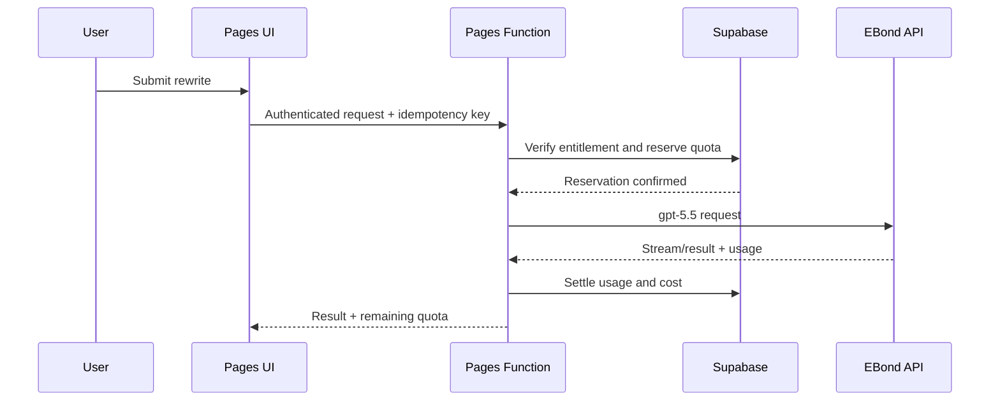

# 后台与会员系统 PRD

> 版本：1.0  
> 日期：2026-08-15  
> 状态：Ready for implementation  
> 产品：Claude Watermark Guide / AI 文本润色工具
> 追踪：[GitHub Issue #1](https://github.com/widecyruschan/claude-watermark-guide/issues/1)

## Problem Statement

现有产品是部署在 Cloudflare Pages 的纯静态工具站，能够在浏览器本地检查部分不可见 Unicode 字符，但没有用户体系、服务端 AI 润色、用量控制、订阅收费或运营后台。用户无法保存自己的会员状态、查看剩余额度、购买套餐或管理账单；运营方也无法控制成本、处理异常账户、查看订阅状态或衡量 AI 请求的质量与毛利。

产品需要在保留“本地字符清理不上传文本”优势的同时，增加由 EBond API `gpt-5.5` 驱动的 AI 文本润色能力，并建立完整但不过度复杂的会员、订阅、配额和管理后台。系统还必须避免将“清理不可见字符”错误宣传为能够识别 AI 来源、移除可靠水印或保证绕过 AI 检测。

当前已经确认的基础条件：

- 前端主体已经完成，当前使用原生 HTML、CSS 和 JavaScript。
- 站点部署在 Cloudflare Pages，production 环境已经配置加密的 `EBOND_API_KEY`。
- EBond 网关根地址为 `https://api.ebondai.com`，模型为 `gpt-5.5`。
- EBond 价格按每百万输入/输出 Token `US$0.6/US$3.6` 估算。
- 首选 Responses API，Chat Completions 作为兼容回退。
- 默认不保存用户提交的原文或模型生成的完整结果。

## Solution

在现有 Cloudflare Pages 项目中增加同源 Pages Functions API，并以 Supabase 提供认证、Postgres 数据库和行级权限，以 Stripe Checkout、Customer Portal 和 Webhook 提供月度订阅。

产品对用户呈现两条清晰独立的能力：

1. 本地字符工具：检测并清理可疑不可见字符、展示移除统计、按用户选择处理长破折号。该流程不上传文本、不要求登录、不消耗额度。
2. AI 文本润色：在保留事实、含义、引用、链接和格式的前提下改善模板化表达、重复、僵硬过渡和句式节奏。该流程要求登录、经过服务端调用模型并消耗会员字符额度。

系统为免费会员提供可体验但可控的月度额度，为 Pro 会员提供更高额度、更长单次文本和账单管理。管理后台提供用户、订阅、用量、成本、错误与审计能力，但不允许管理员查看用户原文。

## Goals and Success Metrics

### 产品目标

- 让新用户无需学习即可完成注册、润色、查看额度和升级订阅。
- 让付费状态在 Stripe 支付成功后可靠地同步为产品权限。
- 保持本地字符工具永久免费且不上传文本。
- 将 AI 成本限制在可预测范围，并能按用户和请求追踪。
- 为运营人员提供足够的后台能力，不在首版建设复杂 CRM 或财务系统。

### 首版成功指标

| 指标 | 目标 |
| --- | --- |
| AI 请求成功率 | 最近 24 小时不低于 98% |
| AI 首字节延迟 | P95 不高于 5 秒 |
| AI 完整请求延迟 | 3,000 字符请求 P95 不高于 20 秒 |
| 支付权限同步 | 95% 在 30 秒内完成，100% 在 2 分钟内完成 |
| 重复扣额度 | 0 |
| 未授权后台访问 | 0 |
| 密钥进入浏览器或 Git | 0 |
| 付费套餐模型毛利 | 正常使用场景不低于 70% |

## Assumptions

- 首版面向英文和国际用户，以 USD 月付；界面文案继续使用英文。
- Pro 暂定 `US$9/月`，正式创建 Stripe Price 前由产品负责人最终确认。
- 免费会员每月 10,000 个输入字符，单次最多 3,000 字符。
- Pro 会员每个账单周期 500,000 个输入字符，单次最多 20,000 字符。
- 用户侧以输入字符作为可理解的额度单位，后台同时记录真实输入/输出 Token 与估算成本。
- 首版不提供年付、团队账户、按量充值包或中国大陆本地支付。

## User Stories

1. As a visitor, I want to clean invisible characters locally without signing in, so that my text never leaves my browser.
2. As a visitor, I want to see which Unicode characters were detected, so that I understand what the tool changed.
3. As a visitor, I want to choose how em dashes are handled, so that the output matches my writing style.
4. As a visitor, I want the site to explain that character cleaning is not proof of AI authorship, so that I am not misled.
5. As a visitor, I want to understand why AI rewriting requires an account, so that the transition from free tool to membership feels reasonable.
6. As a new user, I want to register with an email magic link, so that I do not need to create another password.
7. As a new user, I want to sign in with Google, so that registration takes only one step.
8. As a user, I want my session to persist securely, so that I do not need to log in on every visit.
9. As a user, I want to sign out from the current device, so that I can protect my account on a shared computer.
10. As a free member, I want to submit text for AI rewriting, so that I can evaluate the paid feature before subscribing.
11. As a free member, I want to see my monthly remaining characters, so that I know whether a request can run.
12. As a free member, I want a clear upgrade prompt when my quota is insufficient, so that I know how to continue.
13. As a member, I want to select language, tone, audience and rewrite strength, so that the result matches my context.
14. As a member, I want facts, names, quotes, citations, links and formatting preserved, so that rewriting does not damage the content.
15. As a member, I want to receive the rewritten text progressively, so that long requests do not feel stalled.
16. As a member, I want to stop an in-progress rewrite, so that I can correct an accidental submission.
17. As a member, I want clear retry guidance after a temporary provider failure, so that I do not submit duplicate paid requests.
18. As a member, I want failed requests not to consume quota, so that I only pay for completed work.
19. As a member, I want to copy or download the result, so that I can use it outside the product.
20. As a privacy-conscious user, I want source and result text not to be stored by default, so that sensitive drafts are not retained.
21. As a user, I want to see the current plan, billing period and quota usage, so that I can manage my account.
22. As a user, I want to update my display name, so that the account area reflects my identity.
23. As a user, I want to delete my account, so that I can exercise control over my personal data.
24. As a free member, I want to start a Pro subscription through a trusted checkout, so that payment details are not entered into the product directly.
25. As a Pro member, I want paid access activated after checkout, so that I can use the upgraded quota immediately.
26. As a Pro member, I want to manage payment method, invoices and cancellation through a billing portal, so that billing controls are self-service.
27. As a Pro member, I want access to remain active until the paid period ends after cancellation, so that I receive what I paid for.
28. As a Pro member, I want a clear notice when payment fails, so that I can update my payment method.
29. As a returning subscriber, I want duplicate webhooks not to change my quota twice, so that billing remains consistent.
30. As an administrator, I want to see active users, paid subscribers, AI requests, token cost and error rate, so that I can monitor product health.
31. As an administrator, I want to search users by email or user ID, so that I can resolve support requests.
32. As an administrator, I want to see a user's plan, status and usage metadata without seeing their text, so that support does not compromise privacy.
33. As an administrator, I want to suspend or restore an account, so that abuse can be controlled.
34. As an administrator, I want to grant a manual quota adjustment with a reason, so that support corrections are traceable.
35. As an administrator, I want to inspect subscription and webhook status, so that payment synchronization failures can be diagnosed.
36. As an administrator, I want every sensitive administrative action audited, so that changes are accountable.
37. As an administrator, I want requests blocked when a global cost ceiling is reached, so that provider spending cannot run away.
38. As an operator, I want provider errors categorized separately from product errors, so that incidents can be routed correctly.
39. As an operator, I want to change non-secret model configuration without exposing the API key, so that routine adjustments are safe.
40. As a product owner, I want usage and conversion metrics without storing user text, so that product decisions do not require unnecessary content retention.

## Functional Requirements

### Local character tools

- Detection and cleaning continue to execute entirely in the browser.
- Results show Unicode code point, display name, count and action taken.
- Safe cleaning preserves characters with legitimate linguistic or emoji meaning by default.
- Aggressive cleaning requires an explicit user choice and a warning.
- Em dash replacement is a style preference, not a watermark claim.
- Local operations never call membership or AI APIs and never consume quota.

### Authentication and account

- Support email magic link and Google OAuth.
- Require verified identity before AI rewriting or payment.
- Provide account overview, current plan, usage, billing status, sign-out and account deletion.
- Sessions use Supabase Auth tokens; server authorization never trusts a role or plan sent by the browser.
- Account deletion revokes access immediately, anonymizes product profile data and retains only legally required billing records.

### AI rewriting

- Accept text, language, tone, audience, rewrite strength and formatting preference.
- Reject empty input, unsupported options and text exceeding the plan limit.
- Remove leading/trailing noise before quota calculation without changing internal content.
- Preserve meaning, facts, named entities, numbers, dates, quotes, citations, links and paragraph structure.
- Do not promise “human-written”, “undetectable” or guaranteed detector outcomes.
- Stream output when Responses API streaming is verified; otherwise launch with non-streaming response and retain the same API contract version.
- Use a unique request ID and idempotency key for each rewrite.
- Reserve input-character quota atomically before provider invocation.
- On success, settle actual Token usage and estimated cost.
- On provider failure, timeout or validated cancellation before useful output, release reserved quota.
- Do not cache personalized rewriting responses.
- Do not write source or result text to application logs, analytics or database.

### Membership plans and quota

| Capability | Visitor | Free member | Pro member |
| --- | --- | --- | --- |
| Local character tools | Unlimited | Unlimited | Unlimited |
| AI rewriting | No | Yes | Yes |
| Monthly input characters | 0 | 10,000 | 500,000 |
| Per-request limit | N/A | 3,000 | 20,000 |
| Billing portal | No | No | Yes |
| Stored text history | No | No | No |

- Free quota resets at 00:00 UTC on the first day of each month.
- Pro quota follows the Stripe billing period.
- Unused quota does not roll over.
- Manual adjustments are separate immutable ledger entries and require an administrator reason.
- Quota checks and updates must be atomic to prevent concurrent requests from overspending.

### Billing

- Stripe is the billing source of truth; the application database stores synchronized entitlement state.
- Checkout is created only by an authenticated server endpoint.
- The client may submit a known plan code but never an arbitrary Stripe Price ID or amount.
- Webhook signatures must be verified against the raw request body.
- Webhook event IDs are unique and processed idempotently.
- Required events include checkout completion, successful invoice, failed invoice, subscription update and subscription deletion.
- Active and trialing subscriptions receive Pro entitlement.
- Cancellation at period end retains Pro entitlement until the current period ends.
- Past-due accounts receive a three-day grace period, then revert to Free if payment remains unresolved.
- Refunds and disputes are handled in Stripe Dashboard in the first release; entitlement changes still arrive by webhook.

### Member area

- Show profile, current plan, billing status, renewal date and usage progress.
- Show separate values for base quota, manual adjustments and consumed quota.
- Provide upgrade, manage billing, sign-out and delete-account commands.
- Include loading, empty, expired-session, payment-pending and error states.
- Do not expose provider Token counts as the primary user-facing quota.

### Administration

- Require authenticated `admin` role at both API and database levels.
- Dashboard metrics: registered users, active users, free/Pro distribution, conversion, request count, success rate, P50/P95 latency, input/output Tokens, estimated provider cost and estimated gross margin.
- User management: search, view status/plan/usage, suspend, restore and add quota adjustment.
- Subscription management: view synchronized Stripe IDs, status, period and latest webhook result; billing changes continue through Stripe.
- Request diagnostics: view request ID, user ID, timestamps, model, character/Token counts, latency, status and sanitized error category.
- Audit log: administrator, action, target, reason, timestamp and request ID.
- No administration screen or API may expose submitted or generated text.

## Implementation Decisions

### Architecture

- Retain the existing static frontend and add same-origin Cloudflare Pages Functions for server APIs.
- Use one catch-all API application with shared middleware for request IDs, authentication, authorization, validation, error normalization and logging.
- Use TypeScript for all new server code and shared contracts.
- Use Hono for routing and middleware because the API now has multiple protected routes and shared policies; avoid introducing a larger server framework.
- Use Zod at the external request boundary.
- Use Supabase Auth for identity and Supabase Postgres for membership, usage and audit data.
- Use Postgres functions or transactions for quota reservation, settlement and release.
- Use Stripe-hosted Checkout and Customer Portal instead of building payment forms.
- Call EBond directly from Pages Functions. The EBond key is available only as a production Secret.
- Keep the EBond provider behind a small provider adapter so Responses and Chat Completions can share one internal result shape.
- Treat Stripe, Supabase and EBond as external trust boundaries and normalize their errors before returning responses.

### Request flow

### Data model

| Entity | Purpose | Important fields |
| --- | --- | --- |
| Profile | Product account and authorization | user ID, display name, role, status, timestamps |
| Plan | Server-owned entitlement definition | code, monthly characters, request limit, active flag |
| Subscription | Stripe synchronization | user ID, customer ID, subscription ID, plan, status, period, cancel flag |
| Usage period | Current allowance state | user ID, period start/end, base quota, adjustments, reserved, consumed |
| Usage ledger | Immutable request and adjustment history | request ID, user ID, type, characters, Tokens, cost, status, timestamps |
| Webhook event | Stripe idempotency | provider event ID, type, processing status, timestamps, sanitized error |
| Admin audit | Sensitive action history | administrator ID, action, target, reason, request ID, timestamp |

All user-owned tables enable Row Level Security. Members may read only their own profile, subscription summary and usage. They may not write plan, subscription, usage or role fields directly. Service-role operations remain server-only.

### API contract

| Method and endpoint | Authentication | Purpose |
| --- | --- | --- |
| `GET /api/v1/account` | Member | Return profile, plan and subscription summary |
| `GET /api/v1/usage` | Member | Return current period quota and aggregate usage |
| `POST /api/v1/rewrite` | Member | Validate, reserve quota, call EBond and settle usage |
| `POST /api/v1/billing/checkout` | Member | Create Stripe Checkout for an allowed plan |
| `POST /api/v1/billing/portal` | Pro member | Create Stripe Customer Portal session |
| `POST /api/v1/webhooks/stripe` | Stripe signature | Synchronize billing state idempotently |
| `POST /api/v1/account/delete` | Member + recent auth | Start account deletion workflow |
| `GET /api/v1/admin/metrics` | Admin | Return aggregate product and cost metrics |
| `GET /api/v1/admin/users` | Admin | Search paginated users |
| `GET /api/v1/admin/users/:id` | Admin | Return user support metadata |
| `PATCH /api/v1/admin/users/:id/status` | Admin | Suspend or restore account |
| `POST /api/v1/admin/users/:id/quota-adjustments` | Admin | Add audited quota correction |

All JSON responses include success status and request ID. Errors also include a stable error code and user-safe message. Expected codes include authentication required, permission denied, validation failed, quota exceeded, account suspended, subscription required, provider unavailable, provider timeout, payment pending and internal error.

### Privacy and security

- Never place EBond, Supabase service-role or Stripe secret keys in frontend code, Wrangler plaintext variables, GitHub source or logs.
- Keep non-secret base URLs, model IDs and public Supabase keys separate from encrypted secrets.
- Validate JWT signature, issuer, audience and expiry server-side.
- Enforce RLS even when API authorization already exists.
- Verify Stripe webhook signature before parsing business fields.
- Use constant allowlists for plan codes, rewrite options and redirect origins.
- Apply per-user and per-IP rate limits to AI and billing endpoints.
- Set maximum request body size before JSON parsing.
- Redact authorization headers, cookies, submitted text and generated text from logs.
- Use a global daily provider-cost ceiling and return a controlled unavailable response after the limit is reached.
- Update privacy and terms pages before enabling AI requests, naming EBond, Supabase, Stripe and Cloudflare as relevant processors or infrastructure providers.

### Observability

- Generate a request ID at the edge and propagate it to database records and provider metadata where safe.
- Record structured events for authentication failure, validation failure, quota reservation, provider completion, provider failure, billing synchronization and administrator actions.
- Track latency and cost without storing content.
- Alert on provider failure rate, webhook backlog, repeated quota settlement failure, cost ceiling and elevated authorization failures.

## Testing Decisions

Tests verify external behavior and trust-boundary contracts rather than private helper implementation.

### Primary test seams

1. Rewrite flow seam: authenticated API request through quota settlement, with EBond replaced by a deterministic mock. This verifies validation, entitlement, idempotency, quota behavior, output contract and sanitized errors in one high-level test surface.
2. Billing flow seam: signed Stripe webhook through synchronized subscription entitlement, with database state asserted after duplicate and out-of-order events.
3. Administration seam: role-protected API request through audit creation, verifying both authorization and visible support metadata.

### Required test coverage

- Local character tests cover every supported Unicode code point, legitimate ZWJ/ZWNJ cases, emoji sequences, safe/aggressive modes and em dash options.
- API contract tests cover empty, oversized and invalid option inputs.
- Authentication tests cover missing, expired, malformed and wrong-audience tokens.
- Quota tests cover exact limit, one character over limit, concurrent reservations, provider failure, cancellation, retry and duplicate idempotency keys.
- Provider adapter tests cover Responses success/stream, Chat Completions fallback, malformed response, timeout, rate limit and missing usage.
- Billing tests cover checkout ownership, valid/invalid signatures, duplicate webhooks, out-of-order events, cancellation, past due, grace period and deletion.
- RLS tests prove users cannot read or modify another user's records and cannot promote themselves.
- Admin tests prove members receive forbidden responses and every mutation creates an audit entry.
- E2E tests cover registration, first rewrite, quota display, upgrade, payment-success simulation, billing portal and suspended account.
- Security checks scan built assets and repository files for secret patterns.
- Deployment smoke tests verify home, checker, authentication callback, API health and one mocked rewrite path.

Existing code has no automated test suite, so the implementation establishes Vitest for unit/integration tests and Playwright for the few critical browser journeys. External live services are not required for the default test command.

## Detailed Development Steps

The following order is intentional. Each phase must pass its verification gate before the next phase starts. For one experienced full-stack developer, the expected implementation time is approximately 15 to 20 working days, excluding legal review and payment-account approval.

### Phase 0 — Product and contract lock

Tasks:

- Confirm final product wording: “Invisible Character Cleaner” and “AI Text Rewriter”.
- Confirm provisional Free and Pro quotas and `US$9/month` price.
- Confirm international/English launch assumption.
- Define supported rewrite controls and allowlisted values.
- Create a 50–100 sample evaluation set containing human, AI-assisted, factual, citation-heavy and formatted text.
- Define prompt acceptance criteria: meaning preservation, no added facts, no removed citations and acceptable style change.

Verification:

- Product owner approves plan limits, price and claims.
- Evaluation examples have expected outcomes and contain no production-sensitive data.

### Phase 1 — Engineering foundation

Tasks:

- Add Node package management, TypeScript, formatting, linting and test commands.
- Add the Pages Functions runtime and one API application entry point.
- Add shared request ID, JSON response, validation and error middleware.
- Add an API health endpoint that exposes no secrets.
- Update continuous deployment to run lint, type checking and tests before Pages deployment.
- Ensure static clean URLs and existing SEO pages remain unchanged.

Verification:

- Local development serves static pages and the health API together.
- CI fails on lint, type or test errors.
- Production build contains no Secret values.

### Phase 2 — Supabase authentication and database

Tasks:

- Create Supabase project environments for development and production.
- Configure magic link and Google OAuth redirect URLs.
- Create profile, plan, subscription, usage period, usage ledger, webhook event and admin audit tables.
- Seed Free and Pro plan definitions.
- Implement profile creation after first verified sign-in.
- Enable RLS and minimum grants on all exposed tables.
- Implement atomic quota reserve, settle and release database operations.
- Add one administrator account through a controlled database operation.

Verification:

- A user can register, sign in, refresh and sign out.
- Cross-user reads and writes fail under RLS tests.
- Concurrent quota reservations cannot exceed the allowance.
- Browser access cannot modify plan, role, subscription or usage ledger.

### Phase 3 — EBond AI rewrite API

Tasks:

- Implement the EBond provider adapter using `gpt-5.5`.
- Verify Responses API with the configured production-like development key.
- Implement Chat Completions fallback only if Responses compatibility fails or is incomplete.
- Create the versioned rewrite system prompt and input contract.
- Implement authentication, account-state check, body limit, validation and quota reservation.
- Implement provider timeout, cancellation, retry policy and normalized errors.
- Settle Token usage and estimated cost after successful completion.
- Release reserved quota on eligible failures.
- Prevent text, authorization and key values from entering logs.

Verification:

- Evaluation set meets the agreed meaning-preservation threshold.
- Duplicate idempotency keys never produce duplicate charges.
- Failed provider calls restore quota.
- Cost calculation matches EBond input/output rates within rounding tolerance.
- No request or response content appears in logs or database rows.

### Phase 4 — Member-facing experience

Tasks:

- Add sign-in/register experience with magic link and Google.
- Add account menu and session-expired handling.
- Add AI rewrite controls, progress, cancellation, error and result states.
- Keep local cleaning available without login and clearly separate from AI rewriting.
- Add member area with plan, billing status, period and usage progress.
- Add copy and download actions for rewrite results.
- Add upgrade prompts for authentication, request-size and quota limits.
- Add account deletion confirmation with recent-auth requirement.
- Complete responsive behavior and keyboard accessibility.

Verification:

- Visitor, Free and Pro flows render only their allowed actions.
- Long text and long translated labels do not overflow controls.
- Session expiry does not lose local text before the user chooses to retry.
- Playwright passes on desktop and mobile viewports.

### Phase 5 — Stripe subscription billing

Tasks:

- Create Stripe Product and monthly Pro Price.
- Store allowed Price mapping only on the server.
- Implement authenticated Checkout Session creation.
- Implement Customer Portal Session creation.
- Implement raw-body webhook signature verification and event idempotency.
- Synchronize subscription status, period and Stripe identifiers.
- Implement cancellation-at-period-end and payment-failure grace behavior.
- Add payment-pending and payment-failed states in the member area.
- Configure Stripe test clocks or equivalent test fixtures for lifecycle testing.

Verification:

- Test-mode checkout upgrades the correct user.
- Replaying a webhook changes state only once.
- Cancellation retains Pro until period end.
- Failed payment follows the documented grace-period transition.
- Browser cannot choose arbitrary prices or redirect domains.

### Phase 6 — Administration

Tasks:

- Add server-side admin-role middleware and database policies.
- Build overview metrics with date-range filtering.
- Build paginated user search and user support detail.
- Add suspend/restore actions with mandatory reason.
- Add quota adjustments as immutable ledger entries.
- Add subscription and webhook diagnostic views.
- Add sanitized request diagnostics and cost aggregation.
- Record every admin mutation in the audit log.

Verification:

- Non-admin users cannot access any admin data through UI or direct API calls.
- Admin actions require a reason and produce an audit record.
- No page or endpoint displays submitted or generated text.
- Aggregate Token and cost totals reconcile with ledger test fixtures.

### Phase 7 — Security, privacy and resilience

Tasks:

- Add rate limiting to rewrite, checkout, portal and authentication-sensitive endpoints.
- Add strict body limits, origin checks and security headers.
- Configure global daily cost ceiling and provider circuit breaker.
- Test key rotation without code changes.
- Update privacy, terms and cookie pages for server-side AI and payment processing.
- Add account deletion and retained-billing-data documentation.
- Run dependency, secret and authorization scans.
- Conduct failure drills for EBond outage, Supabase outage and delayed Stripe webhooks.

Verification:

- Secret scan returns no exposed credentials.
- Abuse tests receive controlled `429` responses.
- Provider outage does not deduct completed quota incorrectly.
- Legal pages accurately describe which text leaves the browser and why.

### Phase 8 — Deployment and controlled rollout

Tasks:

- Create separate preview and production configurations and Secrets.
- Apply database migrations before application deployment.
- Deploy to preview and run full smoke/E2E suite.
- Release AI rewriting behind a feature flag to internal accounts first.
- Enable Free members, observe cost/error metrics, then enable Stripe upgrade.
- Configure alerts and an operational rollback checklist.
- Document support procedures for failed payments, quota corrections and account suspension.

Verification:

- Preview and production use different credentials and Stripe modes.
- Rollback restores the previous application without rolling back completed billing records.
- Production dashboard shows request success, latency, cost and webhook health.
- First production billing cycle reconciles Stripe, subscription and usage records.

## Release Acceptance Criteria

- Existing static pages, SEO routes and local checker continue working.
- Local character cleaning sends no network request.
- AI rewrite requires a valid member session and enforces plan limits server-side.
- EBond key and all other secrets exist only in Cloudflare encrypted Secrets.
- Free and Pro quota reservation is atomic and failures do not consume final quota.
- Stripe test-mode lifecycle passes checkout, renewal, failure, cancellation and duplicate-event cases.
- Member area accurately shows plan, period and remaining characters.
- Admin area is inaccessible to normal members and contains no user text.
- Privacy and terms pages describe AI processing and billing providers.
- Lint, type check, unit, integration, E2E and secret scan pass in CI.
- Production smoke tests and rollback procedure are documented and exercised.

## Out of Scope

- Claims that text is guaranteed to be human-written, undetectable or free of an AI watermark.
- Automated academic-integrity evasion or detector-specific optimization.
- Stored rewrite history, document collaboration or cloud file storage.
- Team workspaces, organization billing, seats or role hierarchies beyond member/admin.
- Annual plans, lifetime plans, prepaid Token packs, coupons or referrals.
- China mainland payment providers, multi-currency taxation or automated refund workflows.
- Public developer API, API key management or third-party integrations.
- Mobile applications or browser extensions.
- Dynamic prompt editing from the admin UI.
- Multiple production AI models exposed as a user-selectable setting.

## Risks and Mitigations

| Risk | Mitigation |
| --- | --- |
| EBond is a third-party relay | Keep provider adapter, strict timeout, cost ceiling and documented fallback path |
| Model changes facts during rewriting | Strong preservation prompt, evaluation set, conservative defaults and user disclaimer |
| Concurrent requests overspend quota | Atomic reservation and immutable ledger |
| Stripe events arrive late or out of order | Idempotent event table and state transition rules based on provider timestamps |
| Admin account compromise | Separate role checks, optional MFA and complete mutation audit |
| Sensitive text appears in telemetry | Content-free structured logging and automated log assertions |
| Product claims exceed technical evidence | Use “cleaner” and “rewriter” wording; prohibit detector guarantees |
| Static deployment pipeline omits Functions | Add API health smoke test and verify Functions artifact during CI |

## Further Notes

- The repository currently has no automated test framework, package manifest, Supabase schema or Pages Functions source. These are implementation deliverables, not existing capabilities.
- Production currently has `EBOND_API_KEY` configured and Wrangler can confirm the encrypted binding without revealing its value.
- The previous architectural suggestion of a separate API Worker is superseded for the MVP by same-project Pages Functions because the Secret and deployment already belong to the Pages project. A separate Worker remains a future scaling option, not a launch requirement.
- Before implementation begins, the only product decisions still requiring confirmation are the final Pro price, quotas and launch market. The technical plan does not otherwise depend on unresolved architecture choices.
